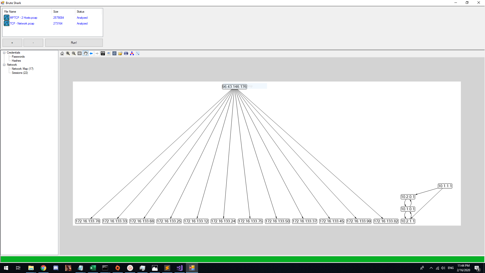

# Brute Shark

BruteShark is a Network Forensic Analysis Tool (NFAT) that performs deep processing and inspiction of a network traffic (mainly PCAP files). It includes: password extracting, building a network map, reconstract TCP sessions, extract hashes of encrypted passwords and even convert them to a Hashcat format in order to perform an offline Brute Force attack.

The main goal of the project is to provide solution to security researchers and network administrators with the task of network traffic analysis while they try to identify weaknesses that can be used by a potential attacker to gain access to critical points on the network.

Two BruteShark versions are availble, A GUI based application (Windows) and a Command Line Interface tool (Windows and Linux).  
The various projects in the solution can also be used independently as infrastructure for analyzing network traffic on Linux or Windows machines. For further details see the Architecture section.

The project was developed in my spare time to address two main passions of mine: software arichtecture and analyzing network data.

## What it can do
* Extracting and encoding user credentials 
* Extract authentication hashes and crack them using Hashcat
* Build visual network diagram
* Reconstract all TCP Sessions

## Installation
Windows - Clone and run defauelt Visual Studio Compiler
Linux Users - run BruteSharkCli using MONO.

# Examples
##### How do i crack (by mistake!) Windows 10 user NTLM password

[](https://youtu.be/AreguLxCCz4)


##### Password Extracting (HTTP, TELNET, IMAP, FTP, SMTP)

##### Hashes Extracting (HTTP-Digest, NTLM, CRAM-MD5)

##### Building a Network Diagram


# Architecture
The solution is designed with three layer architecture, including a one or projects at each layer - DAL, BLL and PL.
The separation between layers is created by the fact that each project refers only its objects.
##### PcapProcessor (DAL)
As the Data Accesss Layer, this project is responsible for reading raw PCAP files using appropriate drivers (WinPcap, libpcap) and their wrapper library SharpPcap.
Can analyze a list of files at once, and provides additional features like reconstraction of all TCP Sessions (using the awesome project TcpRecon).
##### PcapAnalyzer (BLL)
The Bussiness Logic Layer, responsible for analyzing network information (packet, TCP Session etc), implements a plugable mechanism.
Each plugin is basicly a class that implements the interface *IModule*. All plugins are loaded using reflection:
```csharp
private void _initilyzeModulesList()
{
    // Create an instance for any available modules by looking for every class that 
    // implements IModule.
    this._modules = AppDomain.CurrentDomain.GetAssemblies()
                    .SelectMany(s => s.GetTypes())
                    .Where(p => typeof(IModule).IsAssignableFrom(p) && !p.IsInterface)
                    .Select(t => (IModule)Activator.CreateInstance(t))
                    .ToList();

    // Register to each module event.
    foreach(var m in _modules)
    {
        m.ParsedItemDetected += (s, e) => this.ParsedItemDetected(s, e);
    }
    
}
```
##### BruteSharkDesktop (PL)
Desktop application for Windows based on WinForms.
Uses a cross-cutting project by the meaning it referers both the DAL and BLL layers.
This is done by composing each of the layers, register to thier events, when event is trigerd, castin the event object to the next layer objects, and send it to next layer.
```csharp
public MainForm()
{
    InitializeComponent();

    _files = new HashSet<string>();

    // Create the DAL and BLL objects.
    _processor = new PcapProcessor.Processor();
    _analyzer = new PcapAnalyzer.Analyzer();
    _processor.BuildTcpSessions = true;

    // Create the user controls. 
    _networkMapUserControl = new NetworkMapUserControl();
    _networkMapUserControl.Dock = DockStyle.Fill;
    _sessionsExplorerUserControl = new SessionsExplorerUserControl();
    _sessionsExplorerUserControl.Dock = DockStyle.Fill;
    _hashesUserControl = new HashesUserControl();
    _hashesUserControl.Dock = DockStyle.Fill;
    _passwordsUserControl = new GenericTableUserControl();
    _passwordsUserControl.Dock = DockStyle.Fill;

    // Contract the events.
    _processor.TcpPacketArived += (s, e) => _analyzer.Analyze(Casting.CastProcessorTcpPacketToAnalyzerTcpPacket(e.Packet));
    _processor.TcpSessionArived += (s, e) => _analyzer.Analyze(Casting.CastProcessorTcpSessionToAnalyzerTcpSession(e.TcpSession));
    _processor.FileProcessingStarted += (s, e) => SwitchToMainThreadContext(() => OnFileProcessStart(s, e));
    _processor.FileProcessingEnded += (s, e) => SwitchToMainThreadContext(() => OnFileProcessEnd(s, e));
    _processor.ProcessingPrecentsChanged += (s, e) => SwitchToMainThreadContext(() => OnProcessingPrecentsChanged(s, e));
    _analyzer.ParsedItemDetected += (s, e) => SwitchToMainThreadContext(() => OnParsedItemDetected(s, e));
    _processor.TcpSessionArived += (s, e) => SwitchToMainThreadContext(() => OnSessionArived(Casting.CastProcessorTcpSessionToBruteSharkDesktopTcpSession(e.TcpSession)));
    _processor.ProcessingFinished += (s, e) => SwitchToMainThreadContext(() => OnProcessingFinished(s, e));

    InitilizeFilesIconsList();
    this.modulesTreeView.ExpandAll();
}
```
